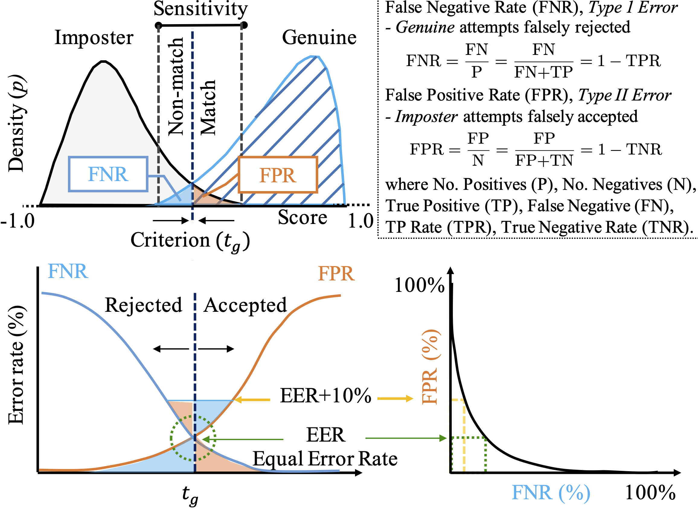

# Face Recognition: Too Bias, or Not Too Bias?

<blockquote>
     Robinson, Joseph P., Gennady Livitz, Yann Henon, Can Qin, Yun Fu, and Samson Timoner. 
     "<a href="https://arxiv.org/pdf/2002.06483.pdf">Face recognition: too bias, or not too bias?
     </a>" 
     <i>In Proceedings of the IEEE/CVF Conference on Computer Vision and Pattern Recognition 
     Workshops</i>, pp. 0-1. 2020.
 </blockquote>

    

      <a href="https://forms.gle/3HDBikmz36i9DnFf7">Download Data</a> 
     

    

      <pre class="bibtex">@inproceedings{robinson2020face,
               title={Face recognition: too bias, or not too bias?},
               author={Robinson, Joseph P and Livitz, Gennady and Henon, Yann and Qin, Can and Fu, Yun and Timoner, Samson},
               booktitle={Proceedings of the IEEE/CVF Conference on Computer Vision and Pattern Recognition Workshops},
               pages={0--1},
               year={2020}
             }
    </pre>
  

   

## Balanced Faces in the Wild (BFW): Data, Code, Evaluations

__version__: 0.4.5 (following Semantic Versioning Scheme-- learn more here, https://semver.org)

Intended to address problems of bias in facial recognition, we built BFW as a labeled data resource made available for evaluating recognitiion systems on a corpus of facial imagery made-up of EQUAL face count for all subjects, which are EQUAL across demographics, and, thus, face data balanced in faces per subject, subjeccts per ethniciity, ethnicity (or faces) per gender.

Data can be accessed via <a href="https://forms.gle/PAKbxgUxCSUbM29q9">Google form</a> <s> or <a href="https://forms.office.com/Pages/ResponsePage.aspx?id=DQSIkWdsW0yxEjajBLZtrQAAAAAAAAAAAAMAAMDJhXxUMElHQ0tVSDFSNDZTMVBPSVpXMkxJTkY4Ny4u">Microsft form</a></s>. __NOTE__ the motivation for the two forms is direct accessibility, as it was reported that locations on Earth were unable to access the original form used. Thus, both forms serve the exact same purpose and grant accesss to the exact same cotents. The difference is that Microsoft may take up to several days to be added while Google is immediate. Do not hesitate to email for any and all inquiries.

## Project Overview
This project investigates bias in automatic facial recognition (FR). Speccifically, subbjects are grouped into predefined subgroups that are based on gender, ethnicity, and soon to be age. For this, we prpose a novel image collection called Balanced Faces in the Wild (BFW), which is balanced across eigth subgroups (i.e., 800 face images of 100 subjects, each with 25 face samples). Thus, along with name (i.e., identification) labels and task protocols (e.g., list of pairs for face verifiication, pre-packaged data-table with additional metadata and labels, etc.), BFW clearly groups into ethnicities (i.e., Asian (A), Black (B), Indian (I), and White (W)) and genders (i.e., Females (F) and Males (M)). The motivation and, thus, the intent is that BFW will provide a proxy to characterize FR systems with demographic-specific analysis now possible. For instance, various confusion metrics, along with the pre-defined criteria (i.e., score threshold) that are fundamental when characterizing performance ratings of FR systems. The following visualizatiion summarizes the confusion metrics in a way that relates the different measurements.

As discusssed up to this point has been the motivation of designing, building, and releasing BFW for research purposes. We expecct the data, all-in-all, will continue to evolve. Nonetheless, as is, there are vast options on ways to advance technology and our understanding thereof. Let us know focus on the contents of the repo (i.e., code-base) for which was created to support the data of BFW (i.e., data proxy), making all experiments in paper easily reproduciable and, thus, the work more friendly for getting started.

## Experimental-based contributions and findings
Several observations were made that widened our understanding of bias in FR. Obsservations were demonstrated experimentally, with all code used in experiments added as a part of thiss repo.

### Score sensitivity
For instance, it is shown that the scoring sensitivity within different subgroups verifies. That is, faces of the same identity tend to shift in expected values (e.g., given a true pair of Black faces, on average, have similarity scores smaller than a true pair of White, and thethe average range of scores for Males compared to Females). This is demonstrated using fundamental signal detection models (SDM), along with detection error trade-off (DET) curves.

### Global threshold
Once a FR system is deployed, a criteria (i.e., theshold) is set (or tunable) such that similarity scores that do not pass are assumed false matchess, and are filtered out of candidate pool for potential true pairs. In other words, thresholds act as decision boundaries that map scores (or distances) to nominal values such as *genuine* or *imposter*. Considering the variable sensitivty found prior, intuition tells us that a variable threshold is optimal. Thus, returning to the fundamental concepts of signal detection theory, we show that using a single, global threshold yields skewed performance ratings across different subgroups. For this, we demonstrate that subgroup-specific thresholds are optimal in terms of overall performance and balance across subgroups. 

### All-in-all
All of this and more (i.e., evaluation and analysis of FR systems on BFW data, along with data structures and implementation schemes that optimized for the problems at hand are included in modules making up the project and demonstrated in notebook tutorials). We will continue to add tools for a fair analysis of FR systems. Thus, not only the experiments, but also the data we expect to grow. All contributions not only welcome, but are entirely encouraged.

Here are quick links to key aspects of this resource.

* Check out research paper, [https://arxiv.org/pdf/2002.06483.pdf](https://arxiv.org/pdf/2002.06483.pdf)
* See [data/README.md](data/README.md) for more on BFW.
* See [code/README.md](code/README.md) for more on 'facebias' package and experiments contained within.
* See [results/README.md](results/README.md) for summary of figures and results.

Register and download via this <a href="https://forms.office.com/Pages/ResponsePage.aspx?id=DQSIkWdsW0yxEjajBLZtrQAAAAAAAAAAAAMAAMDJhXxUMElHQ0tVSDFSNDZTMVBPSVpXMkxJTkY4Ny4u">form</a>.

**Final note.** Thee repo is a work-in-progress. Certainly, it is ready to be cloned and used; however, expect regular improvements, both in the implementation and documentation (i.e., *getting started* instructions will be enhanced). For now, it is recommended to start with README files listed just above, along with the tutorial notebooks found in `code->notebooks`, with brief descriptions in README and more detail inline of each notebook. Again, PRs are more than welocme :)

## Paper abstract
We reveal critical insights into problems of bias in state-of-the-art facial recognition (FR) systems using a novel Balanced Faces In the Wild (BFW) dataset: data balanced for gender and ethnic groups. We show variations in the optimal scoring threshold for face-pairs across different subgroups. Thus, the conventional approach of learning a global threshold for all pairs results in performance gaps between subgroups. By learning subgroup-specific thresholds, we reduce performance gaps, and also show a notable boost in overall performance. Furthermore, we do a human evaluation to measure bias in humans, which supports the hypothesis that an analogous bias exists in human perception. For the BFW database, source code, and more, visit <a href="https://github.com/visionjo/facerec-bias-bfw">https://github.com/visionjo/facerec-bias-bfw</a>.

## To Do
- [x] Begin Template
- [x] Create demo notebooks
- [x] Add manuscript
- [ ] Documentation (sphinx)
- [ ] Update README (this)
- [x] Pre-commit, formatter (Black) and .gitignore
- [ ] Complete test harness
- [x] Modulate (refactor) code
- [ ] Complete datatable (i.e., extend pandas.DataFrame)
- [ ] Add scripts and CLI

## License

All source code is made available under a BSD 3-clause license. You can freely use and modify the code, without warranty, so long as you provide attribution to the authors. See `LICENSE.md` ([LICENSE](LICENSE.md)) for the full license text.

The manuscript text is not open source. The authors reserve the rights to the article content, which is currently submitted for publication in the 2020 IEEE Conference on AMFG.

## Acknowledgement
We would like to thank the [PINGA](https://github.com/pinga-lab?type=source) organization on Github for the [project template](https://github.com/pinga-lab/paper-template) used to structure this project.
