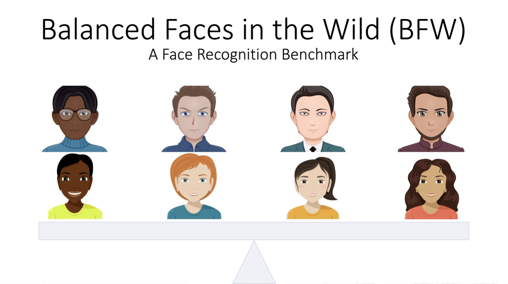
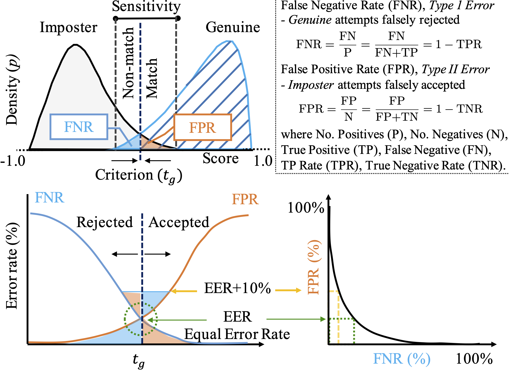

# Face Recognition: Too Bias, or Not Too Bias?

<blockquote>
     Robinson, Joseph P., Gennady Livitz, Yann Henon, Can Qin, Yun Fu, and Samson Timoner. 
     "<a href="https://arxiv.org/pdf/2002.06483.pdf">Face recognition: Too Bias, or Bot Too Bias?
     </a>" 
     <i>In Proceedings of the IEEE/CVF Conference on Computer Vision and Pattern Recognition 
     Workshops</i>, pp. 0-1. 2020.
 </blockquote>

    

      Download Data on <a href="https://www.dropbox.com/scl/fi/5gindh41lrw8j7bgyv9mq/BFW-Release.zip?rlkey=k7kf4knhm18qi3be661m8qmo4&st=w5k6o36d&dl=0">Dropbox</a>. Raw facial crops are also on <a href="https://ieee-dataport.org/documents/balanced-faces-wild">IEEEDataPort</a>.
     

    

      <pre class="bibtex">@inproceedings{robinson2020face,
               title={Face recognition: too Bias, or not too Bias?},
               author={Robinson, Joseph P and Livitz, Gennady and Henon, Yann and Qin, Can and Fu, Yun and Timoner, Samson},
               booktitle={Proceedings of the IEEE/CVF Conference on Computer Vision and Pattern Recognition Workshops},
               pages={0--1},
               year={2020}
             }
    </pre>
  

   

<blockquote>
     Robinson, Joseph P., Can Qin, Yann Henon, Samson Timoner, and Yun Fu. 
     "<a href="https://arxiv.org/pdf/2103.09118.pdf">Balancing Biases and Preserving Privacy on
Balanced Faces in the Wild.</a>" <i>In CoRR arXiv:2103.09118</i>, (2021).
 </blockquote>

    

      <pre class="bibtex">@article{robinson2021balancing,
        title={Balancing Biases and Preserving Privacy on Balanced Faces in the Wild},
        author={Robinson, Joseph P. and Qin, Can and Henon, Yann and Timoner, Samson and Fu, Yun},
        journal={arXiv preprint arXiv:2103.09118},
        year={2021}
       }
    </pre>
  

   

## Balanced Faces in the Wild (BFW): Data, Code, Evaluations

__version__: 0.4.5 (following Semantic Versioning Scheme-- learn more here, https://semver.org)

Intended to address bias in facial recognition, we built BFW as a labeled data resource for evaluating recognition systems on a corpus of facial imagery with an equal number of faces for all subjects: EQUAL across demographics. Thus, face data is balanced across faces per subject, individuals per ethnicity, and ethnicities per gender.

Download data via individual file [https://www.dropbox.com/scl/fo/i2gj82qewyikts2d55xo5/AK5cY0nmJ7Of-iHmD6eF9E4?rlkey=ebj8bbq0giwk30v75r51vsw75&st=slcmpmbn&dl=0](Dropbox), or the entire set using the link above. Please don't hesitate to report an issue or ask any questions.

Also, the same data has been added to IEEEDataPort, which can be accessed at <a href="https://ieee-dataport.org/documents/balanced-faces-wild">https://ieee-dataport.org/documents/balanced-faces-wild</a>.

## Project Overview
This project investigates bias in automatic facial recognition (FR). Specifically, subjects are grouped into predefined subgroups based on gender, ethnicity, and age. For this, we propose a novel image collection called Balanced Faces in the Wild (BFW), which is balanced across eight subgroups (i.e., 800 face images of 100 subjects, each with 25 face samples). Thus, along with the name (i.e., identification) labels and task protocols (e.g., list of pairs for face verification, pre-packaged data table with additional metadata and labels, etc.), BFW groups into ethnicities (i.e., Asian (A), Black (B), Indian (I), and White (W)) and genders (i.e., Females (F) and Males (M)). BFW will provide a proxy to characterize FR systems, now with demographic-specific analysis. For instance, various confusion metrics, along with predefined criteria (e.g., a score threshold), are fundamental to characterizing the performance ratings of FR systems. The following visualization summarizes the confusion metrics in a way that relates to the different measurements.

As we discussed, we designed, built, and released BFW for research purposes. We expect the data to continue to evolve. Nonetheless, as it is, there are vast opportunities for advancing technology and our understanding of it. Let us now focus on the contents of the repo (i.e., codebase) that was created to support the BFW data (i.e., data proxy), making all experiments in the paper easily reproducible and, thus, the work more beginner-friendly.

## Experimental-based contributions and findings
Several observations widened our understanding of bias in FR. Views were demonstrated experimentally, and all code used in the experiments is included in this repo.

### Score sensitivity
For instance, it is shown that the scoring sensitivity within different subgroups is verified. That is, faces of the same identity tend to shift in expected values (e.g., given a correct pair, Black faces, on average, have similarity scores smaller than those for a proper pair of White faces, and the middle range of scores for Males compared to Females). This is demonstrated using fundamental signal detection models (SDM) and detection error trade-off (DET) curves.

### Global threshold
Once an FR system is deployed, a criterion (i.e., threshold) is set (or tunable) such that similarity scores below it are assumed to be false matches and are filtered out of the candidate pool for potential true pairs. In other words, thresholds act as decision boundaries that map scores (or distances) to nominal values such as *genuine* or *imposter*. Given the previously observed variable sensitivity, intuition suggests that a variable threshold is optimal. Thus, returning to the fundamental concepts of signal detection theory, we show that using a single, global threshold yields skewed performance ratings across different subgroups. To this end, we demonstrate that subgroup-specific thresholds are optimal for overall performance and for balancing across subgroups. 

### All-in-all
All this and more (i.e., evaluation and analysis of FR systems on BFW data, data structures, and implementation schemes optimized for the problems at hand) are included in the modules that make up the project and demonstrated in notebook tutorials. We will continue to add tools for a fair analysis of FR systems. Thus, we expect the experiments and the data to grow. I want you to know that all contributions are welcome and entirely encouraged.

Here are quick links to key aspects of this resource.

* Check out research paper, [https://arxiv.org/pdf/2002.06483.pdf](https://arxiv.org/pdf/2002.06483.pdf)
* See [data/README.md](data/README.md) for more on BFW.
* See [code/README.md](code/README.md) for more on the 'facebias' package and experiments contained within.
* See [results/README.md](results/README.md) for summary of figures and results.

**Final note.** The repo is a work-in-progress. Indeed, it is ready to be cloned and used; however, expect regular improvements to both the implementation and documentation (e.g., *getting started* instructions will be enhanced). It is recommended to begin with the README files listed just above, along with the tutorial notebooks found in `code-> notebooks`, with brief descriptions in the README and more detail inline in each notebook. Again, PRs are more than welcome :)

## Paper abstract
We reveal critical insights into bias problems in state-of-the-art facial recognition (FR) systems using a novel Balanced Faces In the Wild (BFW) dataset, which is balanced for gender and ethnic groups. We show variations in the optimal scoring threshold for face pairs across different subgroups. Thus, the conventional approach of learning a global threshold for all pairs results in performance gaps between subgroups. By setting subgroup-specific thresholds, we reduce performance gaps and improve overall performance. Furthermore, we do a human evaluation to measure human bias, which supports the hypothesis that an analogous bias exists in human perception. For the BFW database, source code, and more, visit <a href="https://github.com/visionjo/facerec-bias-bfw">https://github.com/visionjo/facerec-bias-bfw</a>.

## To Do
- [x] Begin Template
- [x] Create demo notebooks
- [x] Add manuscript
- [ ] Documentation (sphinx)
- [ ] Update README (this)
- [x] Pre-commit, formatter (Black), and .gitignore
- [ ] Complete test harness
- [x] Modulate (refactor) code
- [ ] Complete datatable (i.e., extend pandas.DataFrame)
- [ ] Add scripts and CLI

## License

All source code is made available under a BSD 3-clause license. You can freely use and modify the code without warranty, so long as you provide attribution to the authors. See `LICENSE.md` ([LICENSE](LICENSE.md)) for the full license text.

The manuscript text is not open source. The authors reserve the right to the article content, which is currently submitted for publication in the 2020 IEEE Conference on AMFG.

## Acknowledgement
We want to thank the [PINGA](https://github.com/pinga-lab?type=source) organization on GitHub for the [project template](https://github.com/pinga-lab/paper-template) used to structure this project.
